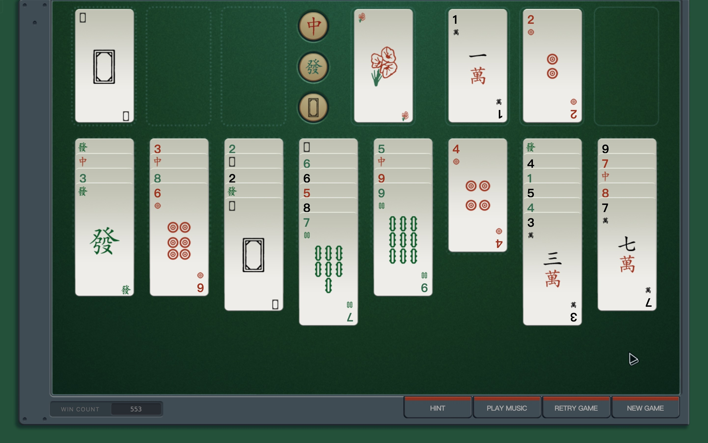

# SHENZHEN I/O Solitaire Game

Yes, this is in the browser! This is a replication of the addictive solitaire game from SHENZHEN I/O. It can use original graphics from the game for a near-identical experience, but without having to keep the game running. The graphics and audio are not included, however, and must be copied from your installation of the game.

_This project is not associated with Zachtronics or [SHENZHEN I/O](http://store.steampowered.com/app/504210/)._

## Features

An integrated solver using A* algorithm is included. By pressing the `HINT` button, the solver will perform a move. Please note that the solver will use some CPU resources.

**There are some URL Parameters:**

- Theme (WIP): `theme=solitaire`
- Debug (Move cards w/o following the rules): `debug={true/false}`
- Hint (Run the solver in background): `hint={true/false}`

For example, `?theme=solitaire&debug=false&hint=false`.

## How to install

1. Download this project from Github as a .zip, and extract.
2. Locate the SHENZHEN I/O Content folder from your installation.
   This will be something like `steamapps\common\SHENZHEN IO\Content`, or `~/Library/Application Support/Steam/steamapps/common/SHENZHEN IO/Shenzhen IO.app/Contents/MacOS/Content` on macOS.
3. Change directory to the `solitaire` folder of the extracted project, and run `extract.sh {PATH_TO_CONTENT}`.
4. Open index.html in your browser. You may need to add the URL parameters mentioned above (especially `theme=solitaire`).